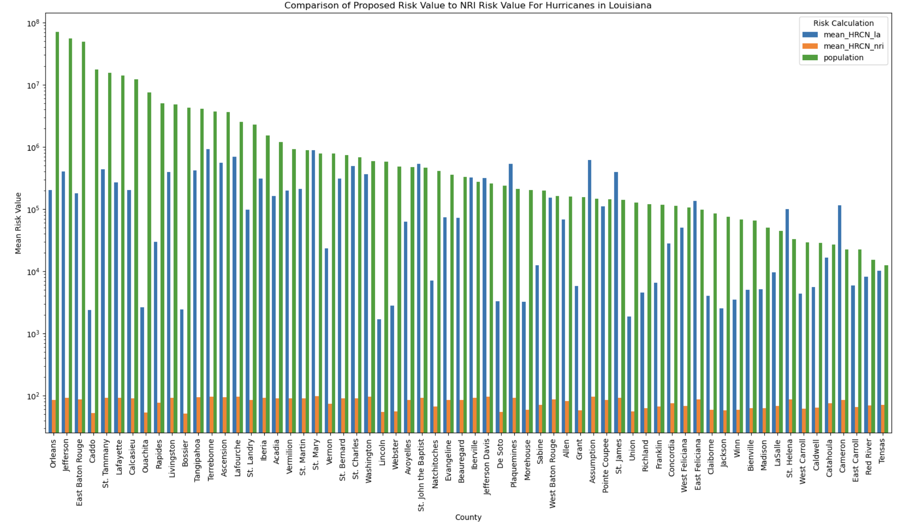
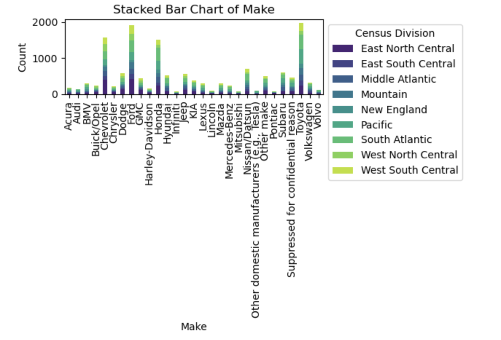

# Broden Dean

Welcome to my personal website! Here you'll find information about my background, projects, and interests.

---

## About Me

I am an undergraduate student in Civil Engineering major at the University of Nebraska-Lincoln with minors in Mathematics, Business, and Construction Managmnent.  
My interests include structure and bridge design.

---

## Skills

- Microstation
- BluBeam
- Microsoft Office
- Python  
- Data Visualization (Matplotlib, Seaborn)  
- Data Analysis  
- Markdown, Git, GitHub Pages
- Project Planning and Scheduling

---

## Past Work

### Example 1: Creating Visualizations of Large Data Sets
  
*During this project I worked with extremely large data sets from a variety of states and organzied the risk of hurricanes by county and then sorted them by population*

### Example 2: 

---

## Connect With Me

- [LinkedIn](https://www.linkedin.com/in/broden-dean-7542a2307/)  
- [GitHub](https://github.com/Broden-Dean-13)  
- [Email Me](mailto:broden.scott.dean@gmail.com)

---

## Navigation

- [Home](index.md)  
- [About Me](about.md)  
- [Contact](contact.md)
